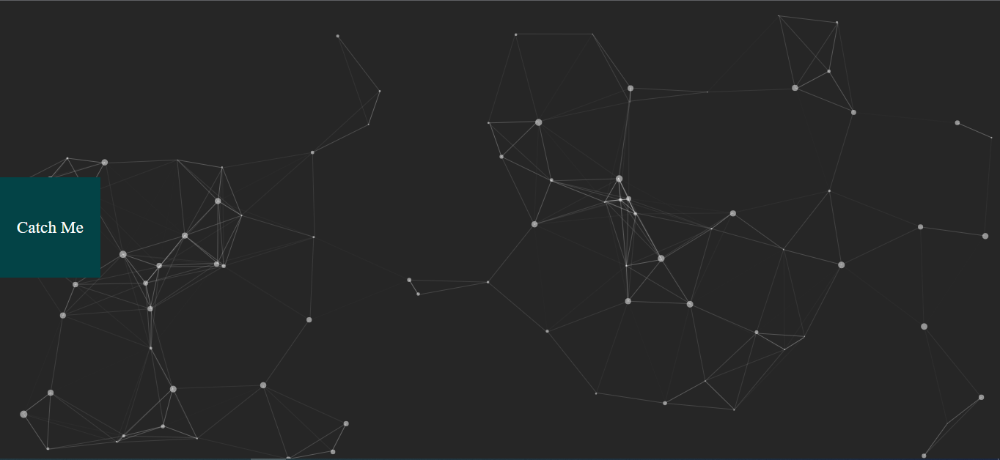

# Catch me if you can

Its a fun game based web app in which i made a box which cannot be caught.

## Lessons Learned

javascript events mouseover and resize and some basic concepts of windows object.
I used inbuilt particle js but get know new things about particle js.

## Screenshot

